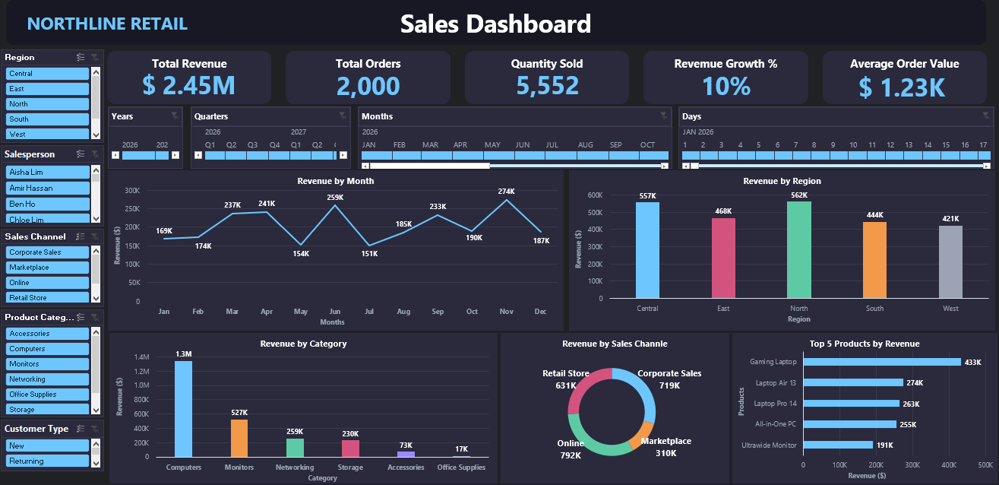
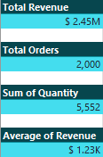
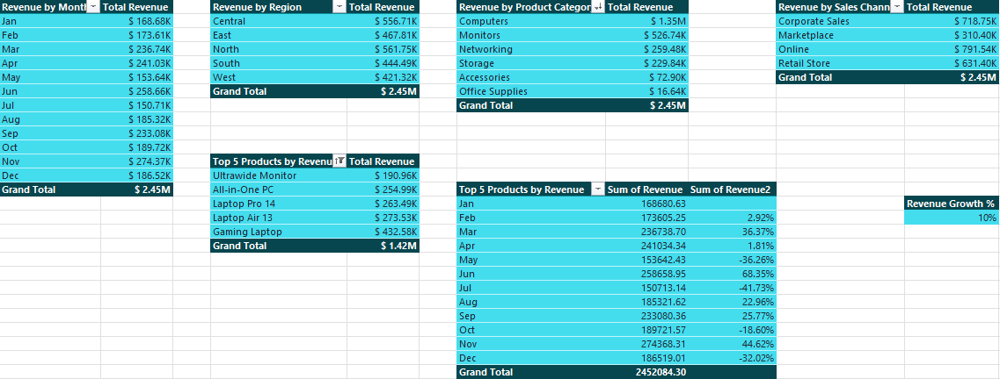
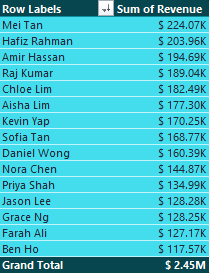

# Northline Retail — Sales Performance Dashboard

> An interactive Excel sales dashboard built to analyse revenue, orders, and product performance across regions, sales channels, and time periods, enabling data-driven decision-making for retail management.

---

## 📊 Project Overview

An interactive, single-page **Sales Performance Dashboard** built using **Microsoft Excel**, developed to transform retail transaction data into a clear and actionable management view of revenue, orders, products, customers, sales channels, and regional performance.

The dashboard analyzes **Northline Retail** sales data across multiple regions, salespeople, product categories, sales channels, and customer types.

The project focuses on transforming raw sales transactions into meaningful KPIs, visualizations, and business insights that support data-driven decision-making.



---

## 🎯 Objective

The main objective of this project was to analyze Northline Retail's sales performance and provide a clear overview of:

- 💰 **Overall performance** — total revenue, orders, quantity sold, growth, and average order value
- 🗺️ **Regional performance** — which regions generate the most revenue
- 👤 **Salesperson performance** — identifying top-performing sales representatives
- 🏷️ **Product performance** — understanding which categories and products drive revenue
- 🛒 **Sales channel performance** — comparing Retail Store, Corporate Sales, Marketplace, and Online
- 👥 **Customer behavior** — comparing New and Returning customers
- 📅 **Monthly trends** — identifying seasonal peaks and periods of weaker performance

The dashboard was designed to turn raw transactional data into a management-friendly analytical tool that allows stakeholders to explore performance interactively.

---

## 🛠️ Tools & Technologies

- Microsoft Excel
- Power Query
- Star Schema
- Interactive Slicers & Filters
- KPI Cards
- Data Visualization

---

## 🔢 Dashboard at a Glance

| KPI / Insight | Value |
|---|---:|
| Total Revenue | **$2.45M** |
| Total Orders | **2,000** |
| Quantity Sold | **5,552** |
| Revenue Growth | **10%** |
| Average Order Value | **$1.23K** |
| Top Region | **North & Central** |
| Leading Category | **Computers** |
| Strongest Channels | **Retail Store & Corporate Sales** |
| Top Salesperson | **Mei Tan — $224.07K** |
| Peak Months | **September & November** |

---

## 🧹 Data Preparation

The sales transaction data was prepared and transformed before being used in the dashboard.

### Dataset Fields

| Field | Description |
|---|---|
| **Order Date** | Date of each transaction |
| **Region** | Central, East, North, South, West |
| **Salesperson** | Sales representative responsible for the order |
| **Sales Channel** | Corporate Sales, Marketplace, Online, Retail Store |
| **Product Category** | Accessories, Computers, Monitors, Networking, Office Supplies, Storage |
| **Product** | Individual product / SKU |
| **Customer Type** | New or Returning |
| **Revenue** | Sales value generated by the order |
| **Quantity** | Units sold |

Power Query was used as part of the data preparation workflow to:

- Clean and transform the source data
- Correct data types
- Prepare fields for analysis
- Organize transactional data
- Prepare tables for the analytical data model

---

# 📈 Analysis & Dashboard
## 💰 Key Performance Indicators

The dashboard contains five headline KPIs that dynamically respond to the selected filters:

| Metric | Value |
|---|---:|
| **Total Revenue** | **$2.45M** |
| **Total Orders** | **2,000** |
| **Quantity Sold** | **5,552** |
| **Revenue Growth %** | **10%** |
| **Average Order Value** | **$1.23K** |

These KPIs provide a quick overview of overall business performance before drilling into individual dimensions.

### 📊 KPI Summary



---

## 🧭 Dashboard Filters

The dashboard provides interactive filters for exploring the data from different perspectives.

### Available Slicers

- **Region**
  - Central
  - East
  - North
  - South
  - West

- **Salesperson**
  - Aisha Lim
  - Amir Hassan
  - Ben Ho
  - Chloe Lim
  - and others

- **Sales Channel**
  - Corporate Sales
  - Marketplace
  - Online
  - Retail Store

- **Product Category**
  - Accessories
  - Computers
  - Monitors
  - Networking
  - Office Supplies
  - Storage

- **Customer Type**
  - New
  - Returning

- **Time Period**
  - Year
  - Quarter
  - Month
  - Day

The interactive filters allow users to combine multiple dimensions and investigate specific segments of the business.

---

## 📊 Visuals & Analysis

### 📅 Revenue by Month

A line chart tracking monthly revenue trends across the year, highlighting seasonal peaks and dips.

Key observations include:

- **September** represents a major revenue peak.
- **November** also shows strong sales performance.
- **April** and **July** represent weaker periods.

These patterns may indicate back-to-school and pre-holiday purchasing behavior.

---

### 🗺️ Revenue by Region

A bar chart comparing total revenue across all five regions.

**North and Central** are the strongest-performing regions, generating the highest levels of revenue.

Potential actions:

- Prioritize inventory allocation to high-performing regions
- Expand successful local promotions to underperforming regions
- Analyze the factors driving stronger regional performance

---

### 🏷️ Revenue by Category

A bar chart showing revenue across the major product categories.

**Computers** are the dominant revenue-driving category, followed by **Monitors** and **Networking**.

Potential actions:

- Bundle high-margin accessories with computer purchases
- Promote complementary products
- Negotiate better supplier terms based on sales volume
- Maintain sufficient inventory for high-demand products

---

### 🛒 Revenue by Sales Channel

A donut chart illustrating how revenue is distributed across:

- Retail Store
- Corporate Sales
- Marketplace
- Online

**Retail Store and Corporate Sales** lead the revenue mix, while Online represents an opportunity for further growth.

Potential actions:

- Investigate friction points in the online buying journey
- Run targeted digital campaigns
- Improve online product visibility
- Introduce online-exclusive promotions

---

### 🏆 Top 5 Products by Revenue

A horizontal bar chart ranking the best-performing SKUs by revenue.

The leading products include:

1. **Gaming Laptop**
2. **Laptop Air 13**
3. **Laptop Pro 14**

This visualization helps management identify products that contribute significantly to overall revenue and may require stronger inventory planning.

---

### 📈 Revenue Breakdown Tables

The dashboard also includes detailed revenue breakdowns across key business dimensions, allowing users to compare performance across regions, categories, channels, products, and time periods.



---

## 👥 Sales Team Performance

A breakdown of revenue attributed to each salesperson is used to identify top performers and potential coaching opportunities.

### 🥇 Top Sales Performers

| Salesperson | Revenue |
|---|---:|
| **Mei Tan** | **$224.07K** |
| **Hafiz Rahman** | **$203.96K** |
| **Amir Hassan** | **$194.69K** |

**Mei Tan** is the highest-performing salesperson based on revenue generated.

### 👥 Revenue by Salesperson



---

## 💡 Business Insights

### 🗺️ Top-Performing Region — North & Central

These regions generate the highest share of revenue.

**Potential actions:**

- Prioritize inventory allocation to these regions
- Expand successful local promotions to underperforming regions
- Analyze successful strategies used in high-performing regions
- Investigate performance gaps in weaker regions

---

### 🖥️ Leading Product Category — Computers

Computers significantly outperform other categories in terms of revenue.

**Potential actions:**

- Bundle high-margin accessories with computer purchases
- Promote complementary products
- Negotiate better supplier terms given sales volume
- Ensure sufficient inventory during peak periods

---

### 🛒 Channel Performance — Retail Store & Corporate Sales

Retail Store and Corporate Sales drive the largest share of revenue, while Online represents an opportunity for growth.

**Potential actions:**

- Investigate friction points in the online buying journey
- Run targeted digital campaigns
- Improve online product visibility
- Analyze customer behavior by channel

---

### 📅 Seasonal Trends

Revenue peaks in **September and November**, while **April and July** are comparatively weaker.

These patterns may indicate:

- Back-to-school demand
- Pre-holiday purchasing
- Seasonal promotions
- Changes in customer purchasing behavior

**Potential actions:**

- Plan inventory ahead of peak months
- Increase staffing during high-demand periods
- Launch promotional campaigns before seasonal spikes
- Use historical trends for demand planning

---

## 🗂️ Repository Structure

```text
northline-retail-dashboard/
│
├── data/
│   └── sales_data.csv
│
├── images/
│   ├── dashboard.png
│   ├── kpi_summary.png
│   ├── revenue_by_salesperson.png
│   └── revenue_breakdown_tables.png
│
├── dashboard/
│   └── northline_sales_dashboard.pbix
│
└── README.md
```

## 🛠️ Tools & Techniques

- **Microsoft Excel**
- **Power Query**
- **Data Modeling**
- **Star Schema**
- **KPI Design**
- **Interactive Slicers**
- **Data Visualization**
- **Business Intelligence**

---

## 💡 Key Skills Demonstrated

- Data Cleaning & Transformation
- Data Analysis
- Data Modeling
- Power Query
- KPI Development
- Interactive Dashboard Design
- Data Visualization
- Business Intelligence
- Sales Performance Analysis
- Regional Analysis
- Product Analysis
- Channel Analysis
- Sales Team Performance Analysis
- Business Storytelling

---

## 📁 Repository Contents

```text
northline-retail-dashboard/

├── data/
│   └── sales_data.csv
│
├── images/
│   ├── dashboard.png
│   ├── kpi_summary.png
│   ├── revenue_by_salesperson.png
│   └── revenue_breakdown_tables.png
│
├── dashboard/
│   └── northline_sales_dashboard.pbix
│
└── README.md
```

---

## ⚠️ Notes & Limitations

- The original Northline Retail transaction dataset is confidential and is therefore **not included** in this repository.
- Sample or synthetic data can be placed in the `data/` folder if the dashboard needs to be reproduced.
- Dashboard figures represent the dataset used during development and may change when a different dataset is connected.
- The current dashboard focuses primarily on revenue performance. Profit and profit-margin analysis can be added when cost data becomes available.

---

## 🚀 Future Improvements

Possible extensions include:

- Adding year-over-year comparison visuals
- Building Customer Lifetime Value (CLV) analysis
- Incorporating profit margin data
- Adding customer retention analysis
- Adding predictive revenue forecasting
- Adding target vs. actual performance
- Creating salesperson targets and achievement KPIs
- Publishing the dashboard to Power BI Service
- Adding automated data refresh
- Building a mobile-optimized dashboard layout

---

## 🎓 Key Takeaways

Using regional, product, channel, salesperson, customer, and time-based dimensions, this dashboard consolidates Northline Retail's sales performance into a single interactive view.

It highlights that:

- **Computers** are the leading product category
- **North and Central** are the top-performing regions
- **Retail Store and Corporate Sales** are the strongest channels
- **Mei Tan** is the highest-revenue salesperson
- **September and November** are key seasonal revenue periods

These insights can directly inform decisions around **inventory planning, staffing, marketing spend, sales strategy, and channel development**.

This project demonstrates an end-to-end **Business Intelligence workflow**, from data cleaning and transformation through data modeling, DAX calculations, dashboard design, visualization, and business interpretation.
